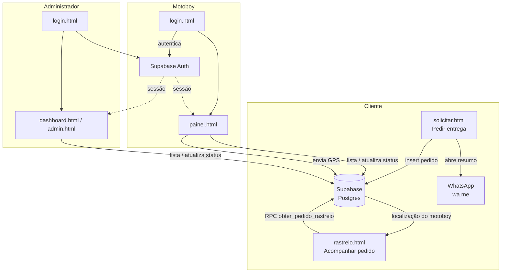

# 🚚 Sistema de Entregas

Sistema web completo para gerenciamento de entregas com motoboy — solicitação de pedidos, rastreamento em tempo real, localização GPS do motoboy e painel administrativo.

Hospedado no **Netlify** · Banco de dados **Supabase**

---

## ✨ Funcionalidades

- 📋 **Solicitação de pedidos** com destino principal e destinos extras ilimitados
- 💬 **Envio automático para WhatsApp** com resumo completo do pedido
- 🔎 **Rastreamento em tempo real** pelo cliente via link/código
- 📍 **Localização GPS do motoboy** transmitida ao vivo para o cliente
- 🗺️ **Navegação GPS** integrada ao Google Maps para cada destino
- 📊 **Dashboard administrativo** com faturamento e filtros por período
- 🔐 **Login seguro** via Supabase Auth com menu de seleção de painéis

---

## 🧩 Arquitetura



- **Cliente**: cria o pedido e recebe o link de rastreio, sem precisar de login.
- **Motoboy** e **Administrador**: fazem login via Supabase Auth e só depois enxergam os pedidos e podem alterá-los.
- **Banco de dados**: Supabase (Postgres) com Row Level Security controlando o que cada perfil pode ler/escrever.

---

## 🗂️ Estrutura do Projeto

```
📁 projeto/
├── index.html                  # Página inicial / formulário de pedido
├── .gitignore
│
├── 📁 pages/
│   ├── login.html              # Login + menu de painéis
│   ├── dashboard.html          # Visão geral e faturamento
│   ├── admin.html              # Lista de pedidos (admin)
│   ├── painel.html             # Painel do motoboy
│   ├── rastreio.html           # Rastreamento do cliente
│   └── solicitar.html          # Formulário de solicitação
│
├── 📁 assets/
│   ├── 📁 js/
│   │   ├── config.example.js   # ← Modelo de credenciais (sobe ao GitHub)
│   │   ├── config.js           # ← Suas credenciais reais (NO .gitignore!)
│   │   ├── supabase.js         # Conexão com o banco
│   │   ├── pedidos.js          # Funções de CRUD de pedidos
│   │   ├── whatsapp.js         # Monta e envia mensagem no WhatsApp
│   │   ├── calculo.js          # Cálculo de valores por bairro
│   │   ├── dados.js            # Cidades e bairros disponíveis
│   │   ├── app.js              # Lógica do formulário de pedido
│   │   ├── admin.js            # Lógica do dashboard/admin
│   │   ├── motoboy.js          # Painel do motoboy + GPS
│   │   ├── rastreio.js         # Rastreamento do cliente
│   │   └── login.js            # Autenticação e menu de painéis
│   │
│   └── 📁 css/
│       ├── admin.css           # Estilos do admin/dashboard/login
│       ├── painel.css          # Estilos do painel do motoboy (tema escuro)
│       ├── rastreio.css        # Estilos do rastreamento (tema escuro)
│       ├── solicitar.css       # Estilos do formulário de pedido
│       ├── home.css            # Estilos da página inicial
│       └── global.css          # Estilos globais
│
└── 📁 database/
    └── schema.sql              # SQL para rodar no Supabase
```

---

## ⚙️ Como configurar

### 1. Clone o repositório

```bash
git clone https://github.com/seu-usuario/seu-repositorio.git
cd seu-repositorio
```

### 2. Configure as credenciais

Copie o arquivo de exemplo e preencha com os seus dados:

```bash
cp assets/js/config.example.js assets/js/config.js
```

Abra `assets/js/config.js` e preencha:

```js
export const SUPABASE_URL = 'https://SEU_PROJETO.supabase.co';
export const SUPABASE_KEY = 'SUA_CHAVE_ANON_AQUI';
export const WHATSAPP    = '55XXXXXXXXXXX'; // com DDI e DDD
```

### 3. Configure o banco de dados (Supabase)

No painel do Supabase, acesse **SQL Editor** e execute o conteúdo do arquivo `database/schema.sql`. Ele irá:

- Adicionar a coluna `destinos_extras` na tabela `pedidos`
- Criar a tabela `motoboy_localizacao`
- Configurar as políticas de segurança (RLS)

### 4. Crie um usuário administrador

No Supabase, vá em **Authentication → Users → Add User** e crie o email e senha do administrador.

### 5. Publique no Netlify

1. Acesse [app.netlify.com](https://app.netlify.com) e faça login
2. Arraste a pasta do projeto (com `assets/js/config.js` já preenchido) para a área de deploy manual
   — ou conecte o repositório do GitHub para deploy automático a cada push
3. Aguarde a publicação — o site estará disponível na URL gerada pelo Netlify

---

## 📱 Como usar

### Cliente solicita entrega
1. Acessa a página inicial
2. Preenche os dados de coleta e destino
3. Adiciona destinos extras se precisar
4. Clica em **Enviar** → abre o WhatsApp com o resumo
5. Recebe o **código e link de rastreamento**

### Administrador
1. Acessa `pages/login.html`
2. Faz login com email e senha
3. Escolhe o painel desejado:
   - **Dashboard** → faturamento, filtros por data
   - **Pedidos** → lista e altera status de todos os pedidos
   - **Painel do Motoboy** → pedidos do dia + GPS
   - **Rastreamento** → consulta por código

### Motoboy
1. Acessa `pages/painel.html`
2. Visualiza os pedidos do dia organizados por status
3. Toca em **🗺 Ir à Coleta** / **Destino Principal** / **Extra #1** para abrir a navegação no Google Maps
4. Toca em **📍 Compartilhar Localização** para transmitir o GPS ao vivo
5. Atualiza o status de cada pedido pelo select

### Cliente rastreia
1. Abre o link recebido no WhatsApp
2. Vê a timeline do pedido (Recebido → Em Coleta → Em Rota → Entregue)
3. Quando o motoboy estiver a caminho, aparece o botão **📍 Ver no Google Maps** com a localização em tempo real

---

## 🗄️ Banco de dados

### Tabela `pedidos`

| Campo | Tipo | Descrição |
|---|---|---|
| `id` | uuid | ID único |
| `numero_pedido` | int | Número sequencial |
| `codigo_rastreio` | text | Código único de rastreio |
| `status` | text | Recebido / Em Coleta / Em Rota / Entregue |
| `nome_coleta` | text | Nome do remetente |
| `telefone_coleta` | text | Telefone do remetente |
| `cidade_coleta` | text | Cidade de coleta |
| `bairro_coleta` | text | Bairro de coleta |
| `rua_coleta` | text | Rua de coleta |
| `nome_destino` | text | Nome do destinatário principal |
| `cidade_destino` | text | Cidade do destino principal |
| `bairro_destino` | text | Bairro do destino principal |
| `rua_destino` | text | Rua do destino principal |
| `destinos_extras` | jsonb | Array com destinos extras |
| `valor_total` | numeric | Valor cobrado |
| `data_entrega` | date | Data agendada |
| `horario_entrega` | text | Horário agendado |
| `criado_em` | timestamptz | Data de criação |

### Tabela `motoboy_localizacao`

| Campo | Tipo | Descrição |
|---|---|---|
| `id` | text | Identificador do motoboy (ex: `motoboy1`) |
| `lat` | float | Latitude |
| `lng` | float | Longitude |
| `atualizado_em` | timestamptz | Última atualização do GPS |

---

## 🛠️ Tecnologias

- **HTML, CSS e JavaScript** puro — sem frameworks, sem build
- **Supabase** — banco de dados PostgreSQL + autenticação
- **Netlify** — hospedagem gratuita
- **Google Maps** — navegação e visualização de localização
- **WhatsApp API** — envio de mensagens via `wa.me`

---

## 📄 Licença

Este projeto está licenciado sob a licença MIT — veja o arquivo [LICENSE](LICENSE) para mais detalhes.

